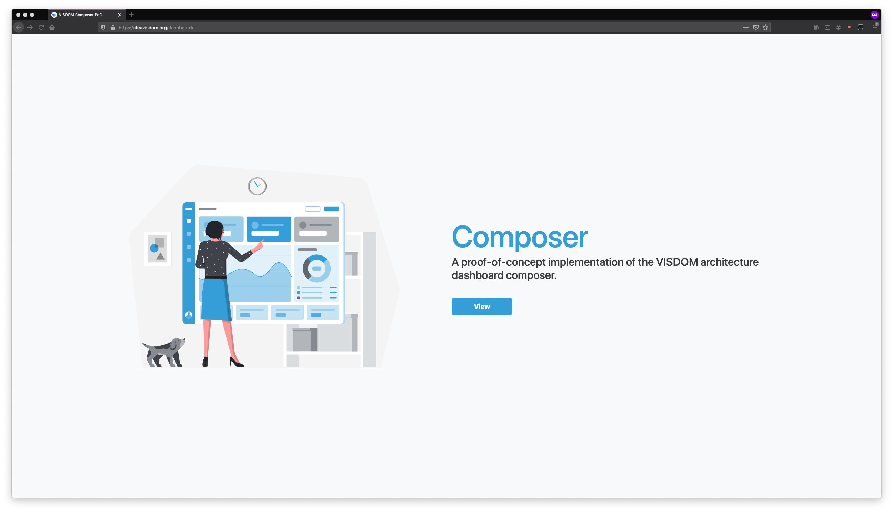
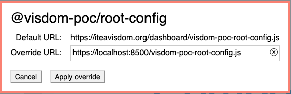

<br />
<p align="center">
  <a href="https://github.com/visdom-project/VISDOM-PoC-Root-Config ">
    
  </a>

  <h3 align="center">VISDOM Architecture - Root-config</h3>

  <p align="center">
    VISDOM architecture infrastructure for the Composer project.
    <br />
    <a href="https://github.com/visdom-project/VISDOM-PoC-Root-Config"><strong>Explore the docs »</strong></a>
    <br />
    <br />
    <a href="https://iteavisdom.org/dashboard/">View Demo</a>
    ·
    <a href="https://github.com/visdom-project/VISDOM-PoC-Root-Config/issues">Report Bug or Request Feature</a>
  </p>
</p>

## Table of Contents

* [About the Project](#about-the-project)
* [Getting Started](#getting-started)
  * [Prerequisites](#prerequisites)
  * [Installation](#installation)
* [Usage](#usage)
* [Contributing](#contributing)
* [License](#license)
* [Contact](#contact)
* [Acknowledgements](#acknowledgements)

## About The Project



This project features the necessary infrastructure for running the dashboard [composer](https://github.com/visdom-project/VISDOM-PoC-Composer) for the [VISDOM](https://iteavisdom.org) project reference architecture. This project is responsible for [providing the necessary infrastructure](https://single-spa.js.org/docs/configuration/) for [registering applications](https://single-spa.js.org/docs/building-applications) to the VISDOM-ecosystem, such as the composer-application. The Root-config project makes use of [import maps](https://wicg.github.io/import-maps/) to include the source code of various applications to the VISDOM-ecosystem. As import maps are not yet readily supported by all the browsers, we utilize the [systemjs](https://github.com/systemjs/systemjs) library to patch that for us.

The different applications are registered as microfrontends and can be developed separately by different teams. Currently, the composer handles the registration and layout of other applications.

This repository is a fork of [React root-config](https://github.com/react-microfrontends/root-config). Moreover, all VISDOM reference architecture implementations are based on the [Single-SPA](https://single-spa.js.org/) framework.

## Getting Started

Complete the following steps to get started. Please see the [Single SPA](https://single-spa.js.org/docs/getting-started-overview) resources for further information on the framework's internals and about [creating your own](https://single-spa.js.org/docs/create-single-spa) visualization services. You can find examples of Single-SPA applications [here]( https://single-spa.js.org/docs/examples/).

This project uses [React](https://reactjs.org/) and [Yarn](https://yarnpkg.com/) as the default development tools. Please note that other registered applications may use whatever frameworks they want, as long as they are created as Single-SPA applications.

### Prerequisites

You need [Yarn](https://yarnpkg.com/) and/or [npm](https://www.npmjs.com/). This guide is written with Yarn in mind.

### Installation

This repository assumes you are using Linux or Mac. Windows users are on their own. However, the setup should not differ that much.

1. Clone the repo
```sh
git clone https://github.com/visdom-project/VISDOM-PoC-Root-Config.git
```
2. Navigate to the directory
```sh
cd VISDOM-PoC-Root-Config
```
3. Install packages
```sh
yarn install
```

## Usage

Single SPA applications can be developed either separately or all together.

### Local development

Please see [full documentation](https://single-spa.js.org/docs/recommended-setup#local-development) from the SPA documents.

There are two ways to do local development. It is preferred to do one module at a time, whenever possible.

#### One module at a time

```sh
cd VISDOM-PoC-Root-Config
yarn install
yarn start
```

Go to https://localhost:8500/ and verify that you are able to access the page without any SSL problems. To solve SSL problems, see [these instructions](https://improveandrepeat.com/2016/09/allowing-self-signed-certificates-on-localhost-with-chrome-and-firefox/).

Now, go to your production server (or use the microfrontends [demo](https://iteavisdom.org/dashboard)). In the browser console, run the following:

```js
localStorage.setItem("devtools", true);
```

Refresh the page. Click on the tan / beige rectangle:


Set an [import map override](https://github.com/joeldenning/import-map-overrides/) to `8500`.



Refresh the page. Your local code for this module will now be running on your production server (or in the [demo](https://iteavisdom.org/dashboard)). You may make changes locally and refresh the page to see them.

#### All modules together

Run the root-config project locally:

```
cd VISDOM-PoC-Root-Config
yarn install
yarn start
```

Now follow the steps above for "One module at a time" for each of the modules you wish to work on.

## Contributing

You can contribute to this project with the following steps:

1. Fork the Project
2. Create your Feature Branch (`git checkout -b feature/AmazingFeature`)
3. Commit your Changes (`git commit -m 'Add some AmazingFeature'`)
4. Push to the Branch (`git push origin feature/AmazingFeature`)
5. Open a Pull Request

## License

Distributed under the MIT License. See `LICENSE` for more information.

## Contact

Research project link: [https://iteavisdom.org/](https://iteavisdom.org/)

Repository Link: [https://github.com/visdom-project/VISDOM-PoC-Root-Config](https://github.com/visdom-project/VISDOM-PoC-Root-Config)

## Acknowledgements
* [React root-config](https://github.com/react-microfrontends/root-config)
* [React microfrontends](https://react.microfrontends.app/)
